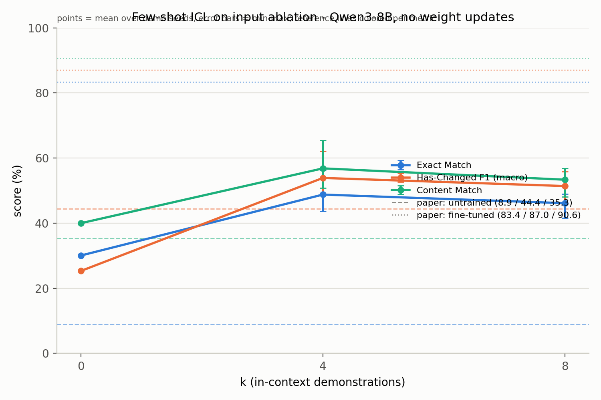

# Few-shot ICL on the input-ablation task (no weight updates)

## What & why

The paper *Training Language Models to Explain Their Own Computations* (Li et al., arXiv:2511.08579) fine-tunes Qwen3-8B to report how its own answer to an MMLU question would change if an injected hint were removed, reaching **83.4 Exact Match / 87.0 Has-Changed F1 / 90.6 Content Match** (Table 2), while *untrained* Qwen3-8B scores only **8.9 / 44.4 / 35.3**. The untrained baseline (Appendix H.3) is zero-shot with format examples only — the prompt shows the two allowed output shapes but contains no solved demonstrations. This experiment asks whether balanced few-shot in-context learning (k = 0, 4, 8 solved demonstrations, 3 demo seeds, no weight updates) closes any of that gap under the same prompt template and metrics. If it does, part of the capability is elicitable by task induction alone; if not, the paper's fine-tuning result stands even stronger.

## Method

- **Prompt structure.** Chat messages rendered with `tokenizer.apply_chat_template(..., tokenize=False, add_generation_prompt=True, enable_thinking=False)`. The system message is the row's `system_prompt`. Each of the k demonstrations (drawn from the **train** split only) is a complete solved instance of the zero-shot format: a user turn holding the demo's `hint_user_prompt` plus the full instruction block copied verbatim from `config/input_ablation/zs_qwen_qwen_hint.yaml` (repeated in every demo turn), then an assistant turn holding the demo's true gold string. The final user turn is the test row's `hint_user_prompt` plus the same instruction block. `run_icl.py --inspect` re-verifies the embedded block against the yaml at runtime.
- **`enable_thinking=False` always, identical across all k.** This is a design decision: thinking mode is held constant so that k is the only variable between conditions.
- **Demonstrations.** Per (k, seed), `random.Random(seed)` draws k/2 train rows whose answer changed because of the hint and k/2 whose answer did not; the bank is fixed for the whole condition and the chosen train indices are logged in `results/run_metadata.json`. k = 0 is seed-independent and runs once.
- **Gold construction.** `gold_changed` mirrors the upstream dataloader (`dataloaders/hint_attribution.py`): `changed_pred_bc_hint` when present, else derived as `random_hint_prediction != zeroshot_prediction` (the field is null for ~24% of rows in both splits; the derivation agrees with every non-null label). `gold_letter` is the letter of `zeroshot_prediction` (the no-hint answer). Gold strings follow the format the yaml prompt instructs the model to emit ("The output would change to <<<Answer: X>>>."); note the upstream training target for changed items instead reads "The most likely output would change to <<<...>>>." — the parser accepts both phrasings.
- **Decoding.** bf16, single GPU, greedy (`do_sample=False`), `max_new_tokens=40`, left padding, only newly generated tokens decoded.
- **Metrics** (all in percent, over all evaluated items, unparseable counted as incorrect; parse rate reported per condition): Exact Match = parsed changed/unchanged verdict **and** parsed letter both correct; Has-Changed macro F1 over parseable items only (an item is parseable iff both the verdict and the letter parse); Content Match = parsed letter correct. Because Exact Match is computed from the parsed output rather than by strict string equality against the upstream "most likely" target strings, the k = 0 row may land somewhat above the paper's 8.9 (an untrained model that follows the prompt's own format can never strict-string-match a changed-item target). Paired bootstrap (10,000 resamples over test items) gives 95% CIs on ΔEM of each (k > 0, seed) vs k = 0.

## How to run on HPC

```bash
# ---------- 0. Login (login node has internet; compute nodes run offline) ----------
ssh iwi5359h@alex.nhr.fau.de

# ---------- 1. One-time: conda env on vault ----------
source /etc/profile
module load python/3.12-conda
conda create -p /home/vault/iwi5/iwi5359h/envs/iclhint python=3.12 -y
source activate /home/vault/iwi5/iwi5359h/envs/iclhint
pip install torch --index-url https://download.pytorch.org/whl/cu128

# ---------- 2. One-time: clone the fork (code lives on /home/hpc) ----------
mkdir -p /home/hpc/iwi5/iwi5359h/my_repos && cd /home/hpc/iwi5/iwi5359h/my_repos
git clone https://github.com/ThreeSwordAI/introspective-interp.git
cd introspective-interp/experiments/icl_input_ablation
pip install -r requirements.txt
mkdir -p /home/vault/iwi5/iwi5359h/icl_input_ablation/logs

# ---------- 3. One-time: pre-download model + dataset on the LOGIN node ----------
export HF_HOME=/home/vault/iwi5/iwi5359h/hf_cache
python3 - <<'EOF'
from huggingface_hub import snapshot_download
from datasets import load_dataset
snapshot_download("Qwen/Qwen3-8B")
load_dataset("Transluce/input_ablation_qwen3_8b_mmlu_hint")
print("download ok")
EOF

# ---------- 4. Schema check (CPU, login node, seconds) ----------
python3 run_icl.py --inspect        # read the printed prompts/fields; must look right

# ---------- 5. Pilot on GPU (edit sbatch: uncomment PILOT line, comment FULL) ----------
sbatch job_icl.sbatch
squeue -u iwi5359h                  # watch; then check the log:
tail -f /home/vault/iwi5/iwi5359h/icl_input_ablation/logs/job_<JOBID>.log
python3 score.py                    # pilot gate: k=0 should land near Table 2 (8.9 / 44.4 / 35.3)

# ---------- 6. Full run (restore FULL line in sbatch) ----------
sbatch job_icl.sbatch

# ---------- 7. Ship results back ----------
cd /home/hpc/iwi5/iwi5359h/my_repos/introspective-interp
git add experiments/icl_input_ablation/results
git commit -m "results: ICL input-ablation, full test split, k=0/4/8 x 3 seeds"
git push
```

Interactive debugging alternative to step 5: `salloc --gres=gpu:a40:1 --partition=a40 --time=01:00:00`, then the same `source /etc/profile` / `module load` / `source activate` lines and run the pilot command directly.

**Pilot gate:** if the k=0 pilot is wildly off Table 2 (e.g., EM > 25 or F1 < 30), something is wrong (template, thinking mode, parsing) — report the numbers and debug before the full run. A few points of deviation is fine (300-item subset, possible decoding differences, and the parse-based Exact Match noted under Method).

Moving from pilot to full run needs no cleanup: a predictions file only satisfies crash-resume if it covers the current run's item count, so the full run automatically re-runs the 300-item pilot conditions rather than silently reusing them; `score.py` additionally refuses to score conditions with unequal item counts together.

## Results

Full test split (n = 1,400 per condition), Qwen3-8B, greedy decoding. Parse rate was **1.0 in every condition** (0 unparseable outputs out of 9,800 generations). All scores in percent; ΔEM is the paired difference vs k=0 with a 10,000-resample bootstrap 95% CI.

| k | seed | n | parse rate | Exact Match | Has-Changed F1 (macro) | Content Match | ΔEM vs k=0 [95% CI] |
|---|------|------|-----------|-------------|------------------------|---------------|----------------------|
| 0 | –    | 1400 | 1.00 | 30.07 | 25.33 | 40.00 | – |
| 4 | 0    | 1400 | 1.00 | 43.71 | 48.82 | 50.86 | +13.64 [+11.14, +16.29] |
| 4 | 1    | 1400 | 1.00 | 56.36 | 62.16 | 65.43 | +26.29 [+23.14, +29.36] |
| 4 | 2    | 1400 | 1.00 | 46.29 | 50.71 | 54.21 | +16.21 [+13.57, +18.79] |
| **4** | **mean** | | 1.00 | **48.79** | **53.90** | **56.83** | **+18.71** |
| 8 | 0    | 1400 | 1.00 | 41.57 | 45.71 | 48.07 | +11.50 [+9.00, +14.07] |
| 8 | 1    | 1400 | 1.00 | 49.00 | 55.87 | 56.79 | +18.93 [+16.14, +21.79] |
| 8 | 2    | 1400 | 1.00 | 47.86 | 52.64 | 55.21 | +17.79 [+15.07, +20.57] |
| **8** | **mean** | | 1.00 | **46.14** | **51.41** | **53.36** | **+16.07** |

Reference (paper Table 2): untrained Qwen3-8B 8.9 / 44.4 / 35.3; fine-tuned self-explainer 83.4 / 87.0 / 90.6 — see the baseline-comparability note under Interpretation before comparing to the untrained row.



## Interpretation

**Outcome: ICL clearly lifts the untrained explainer, but stays far below the fine-tuned ceiling** (outcome B in the study plan). Four balanced demonstrations raise mean Exact Match from 30.07 to 48.79 (ΔEM per seed +13.64 / +26.29 / +16.21, every 95% CI excluding zero); eight demonstrations give 46.14 (+11.50 / +18.93 / +17.79). Even the best single condition (k=4, seed 1: EM 56.36) remains ~27 points below the fine-tuned 83.4. So part of the self-explanation capability is elicitable by task induction alone — the claim "fine-tuning is essential" is better stated as "zero-shot elicitation is weak; ICL recovers a meaningful fraction of the capability, and fine-tuning is what makes it reliable."

**Mechanism.** At k=0 the model's policy is degenerate: it answers "remain unchanged" on 99.5% of items (7/1,400 "change to" verdicts), exact-matching 90.1% of unchanged golds but 0.11% of changed golds (gold rate: 66.7% changed). Demonstrations partially un-collapse this prior — the predicted-changed rate rises to 26–52% across k>0 conditions — which is where the EM/F1 gains come from. This also explains the two secondary observations: k=8 is *not* better than k=4 on average (46.14 vs 48.79), and demo-seed variance is large (k=4 EM spans 43.71–56.36), i.e., which random balanced bank you draw matters more than adding four more demos.

**Baseline comparability (why our k=0 ≠ the paper's 8.9/44.4/35.3).** Our k=0 baseline is *stronger by construction*, so the untrained row of Table 2 is only indicative here: (1) this pipeline holds `enable_thinking=False` with `max_new_tokens=40`, yielding a 100% parse rate, while the upstream eval code passes no `enable_thinking` (Qwen3's chat template then defaults to thinking mode) with a ~50-token generation cap, which truncates deliberation and yields invalid outputs that score 0 under strict exact match; (2) our EM is parse-based, though this matters little here — re-scoring our k=0 raw outputs with the paper's strict-string normalization against upstream's "most likely" gold phrasing gives 30.00 vs our 30.07, because the k=0 model almost never emits a changed verdict; (3) our Has-Changed F1 is a macro average over parseable items — at k=0 it decomposes into F1(changed)=0.85 (recall 0.4%) and F1(unchanged)=49.81, a class-collapse signature that validity-filtered accounting hides; (4) we evaluate all 1,400 test rows, whereas the upstream dataloader skips prompts over 500 tokens. The within-experiment comparisons (k>0 vs k=0, identical prompt template, identical decoding, paired on items) are unaffected by all four points; the fine-tuned 83.4/87.0/90.6 remains the meaningful ceiling.

## Reproducibility

- Predictions were generated on the FAU NHR Alex cluster, 1× NVIDIA A40, from code commit `7ada6f60741e882608824dd5dec9b5cad4b6558e` (recorded in `results/run_metadata.json`); the results were committed as `e71209c67296871cd9e2e3decb6563b7f3867f4a`.
- Environment: Python 3.12 conda env, `torch 2.10.0+cu128`, `transformers 5.1.0`; bf16, greedy decoding, `max_new_tokens=40`, batch size 8, left padding, `enable_thinking=False`.
- Full test split (1,400 items), no items skipped for length; demo seeds 0/1/2; the exact demo train-row indices per condition are in `results/run_metadata.json`. Total GPU wall time ≈ 65 min for all 7 conditions.
- Scoring is deterministic: re-running `python3 score.py` on the committed `preds_*.jsonl` regenerates `metrics.csv` byte-identically (bootstrap RNG seeded with 12345).

## Limitations

- Single model (Qwen3-8B); no evidence the effect size transfers to other scales or families.
- Demonstrations are randomly sampled (balanced by changed/unchanged), not retrieved by similarity.
- Nominal-format ICL only: demos reuse the zero-shot format with its instruction block; other demo formats (e.g., without repeated instructions, or with rationales) are untested.
